# 10-10-2025 User story

# Userstory Guest

## 1. Spellen bekijken

Als gast wil ik een overzicht kunnen zien van alle drankspellen,
zodat ik ideeën krijg over welke drankspellen er bestaan.

## 2. Detail van een spel lezen

Als gast wil ik op een spel kunnen klikken om de details, regels en benodigdheden te lezen,
zodat ik begrijp hoe het gespeeld wordt.

## 3. Zoeken en filteren

Als gast wil ik drankspellen kunnen zoeken of filteren op type of moeilijkheid,
zodat ik snel een spel vind dat past bij mijn groep of gelegenheid.

## 4. Navigeren op de website

Als gast wil ik makkelijk kunnen navigeren tussen pagina’s zoals “Alle Spellen” en “Over Boozebuddies”,
zodat ik de website intuïtief kan gebruiken zonder account.

## 5. Aangemoedigd worden om in te loggen of registreren

Als gast wil ik bij acties zoals “spel aanmaken” of “favoriet maken” een melding of loginprompt krijgen,
zodat ik weet dat ik een account nodig heb voor die functies.

# Userstory Logged in

## 1. Spellen aanmaken

Als ingelogde gebruiker wil ik een nieuw drankspel kunnen aanmaken via een formulier,
zodat ik mijn eigen spelideeën met anderen kan delen.

## 2. Spellen bewerken

Als ingelogde gebruiker wil ik mijn eigen aangemaakte drankspellen kunnen bewerken,
zodat ik fouten kan verbeteren of extra informatie kan toevoegen.

## 3. Spellen verwijderen (na 3 spellen toegevoegd

Als ingelogde gebruiker wil ik mijn eigen spellen kunnen verwijderen,
zodat ik controle heb over welke spellen zichtbaar blijven.

# User story Admin

## 1. Overzicht 
Als admin wil ik alle games oevrzichtelijk zien.

## 2. Bewerken
Als admin kan ik alle spellen bewerken.

## 3. Verwijderen
Als admin kan ik alle spellen verwijderen van de gebruikers.

## 4. Toevoegen
Als admin kan ik ook een eigen game aanmaken.

## 5. Online/Offline
Als admin kan ik games online of offline halen

## ERD in Miro

Hier ben ik met een ERD begonnen. Ik wist hier toen niet dat het in drawsql moest omdat ik mijn teamskanaal voor PRG5
nog op hidden had.
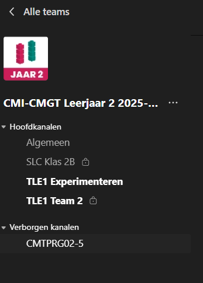

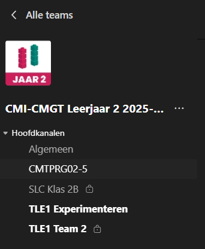

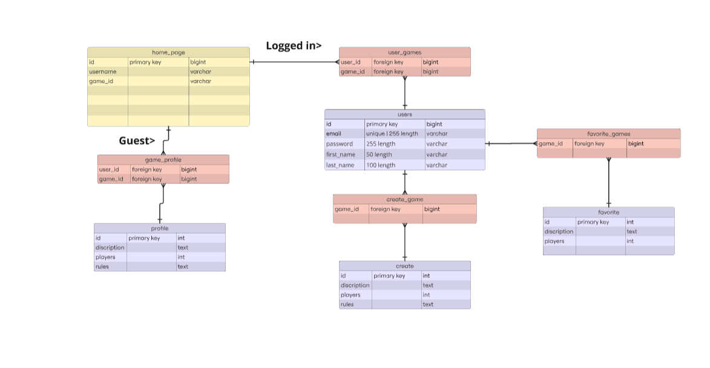

# 13-10-2025 ERD goedkeuring

## hulp van Antwan

Ik heb feedback gevraagd aan Antwan van mijn ERd in Miro, natuurlijk was het niet goed omdat ik de teamskanaal niet open
had. Ik heb de teamskanaal gelijk uit de hidden kanalen gedaan en het via drawsql gedaan.
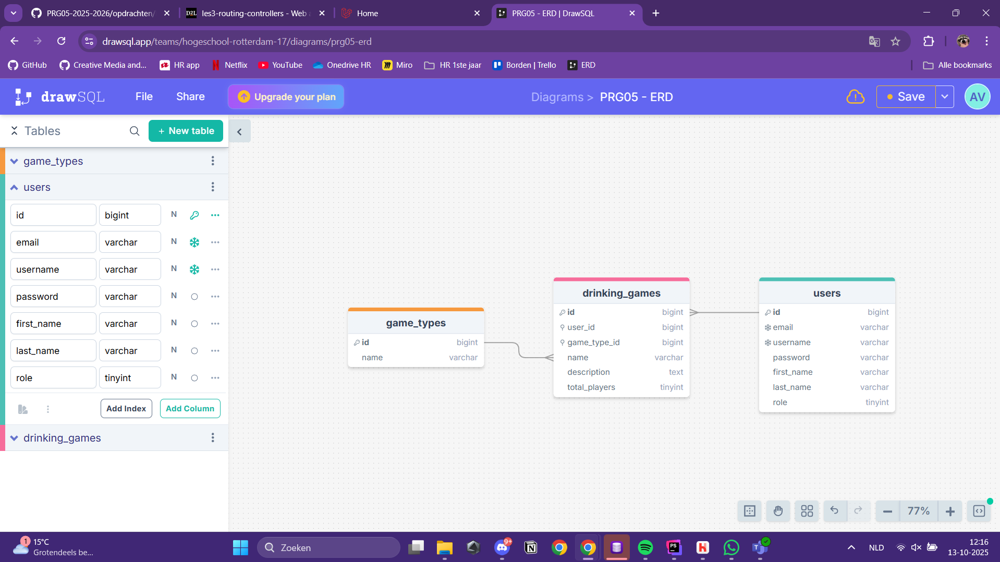

# 14-10-2025 Database toevoegen

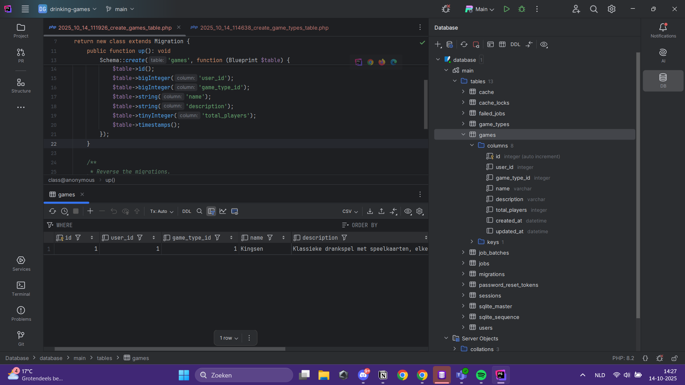

# 15-10-25 Homepage fix + Create form

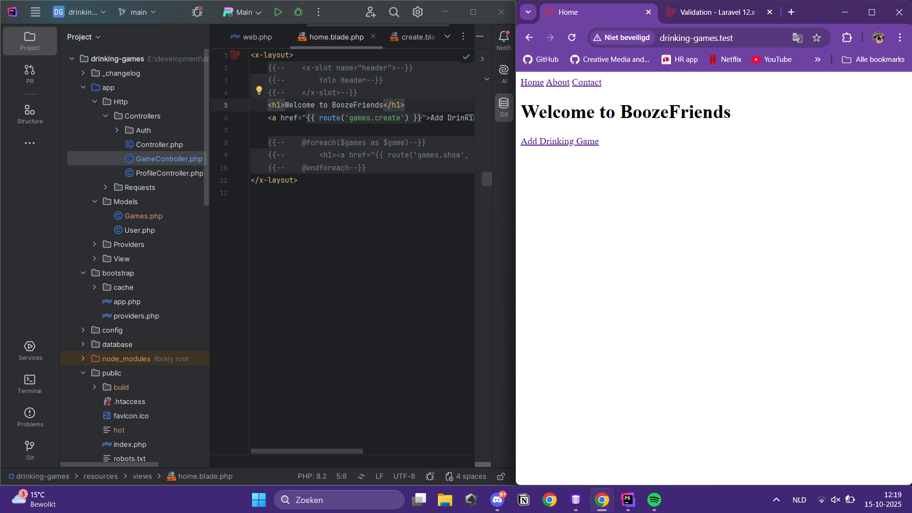
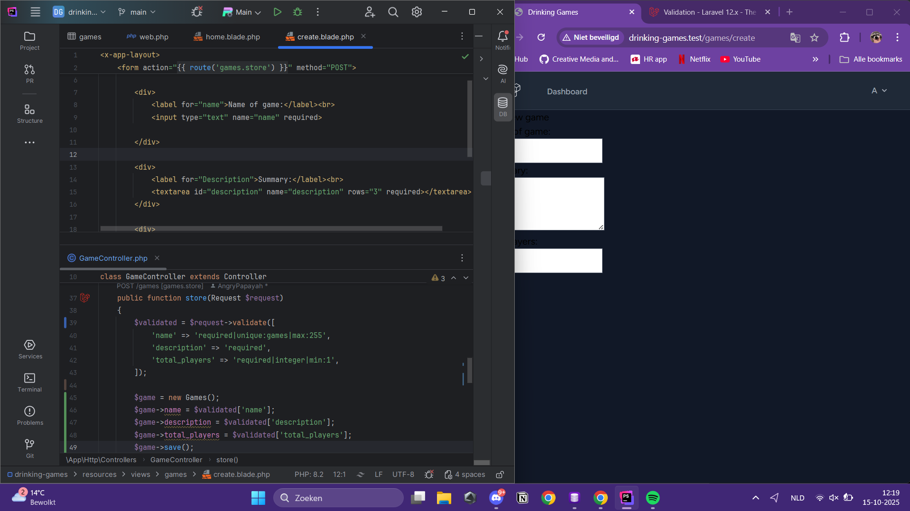

# 27-10-2025
Na de vakantie ben ik snel weer aan de slag gegaan omdat ik best wel achter liep. Mijn database werkte nog niet en ik heb dubbel zitten werken in mijn project.
Op deze dag heb ik alles even recht gezet en proberen bij te lopen.

## Before

## After + database kunnen linken
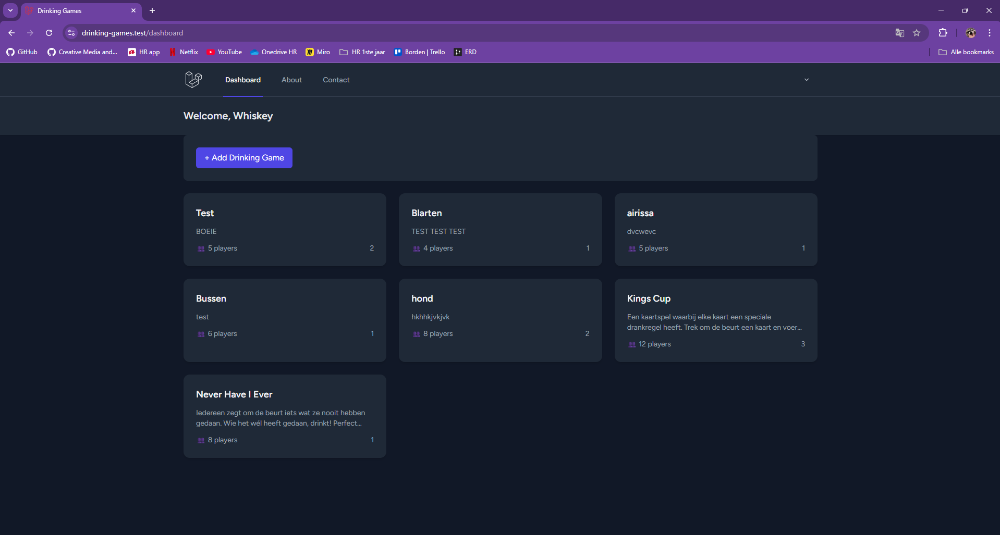

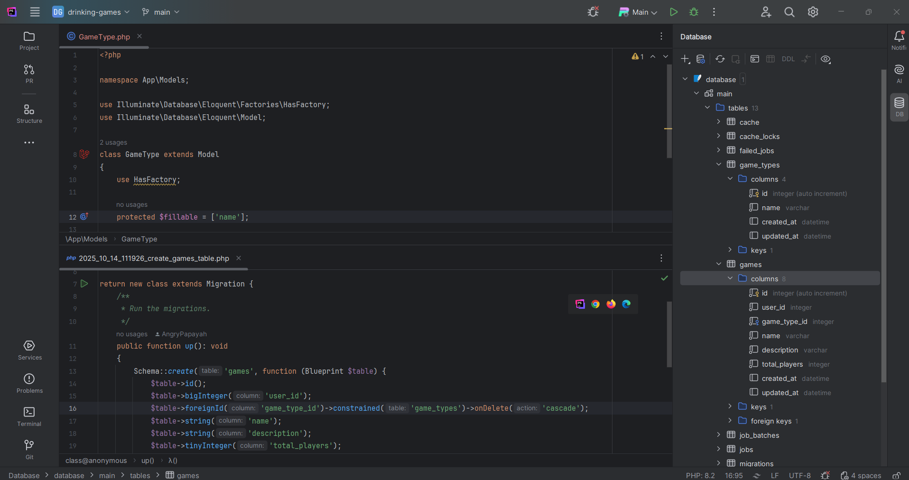

## Create CSS aangepast
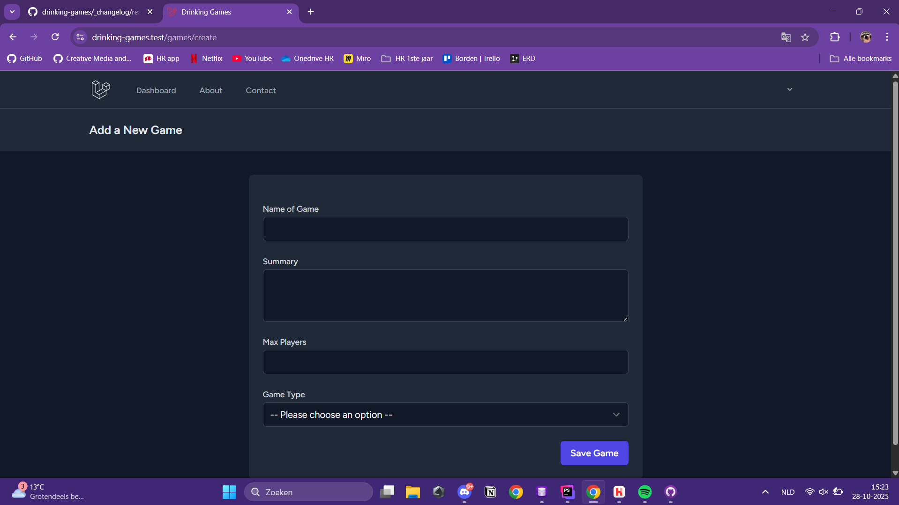

# 28-10-2025 
Hier heb ik de filter systeem erin gezet. Helaas werkt hij nog niet, dus moet ik dat nog even aanpassen.
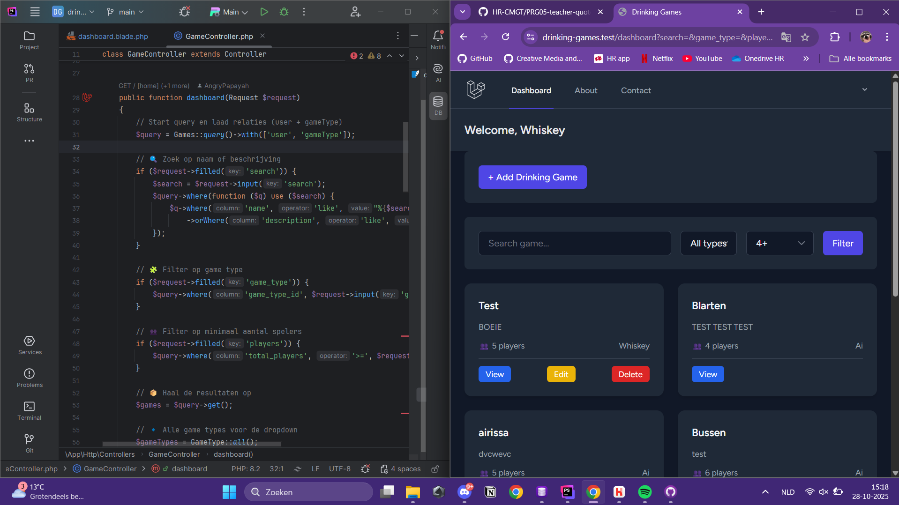

# 1-11-2025 / 2-11-2025
Omdat ik in het weekend veel had gewerkt ben ik op zaterdag avond verder gegaan aan:

## admin dashboard
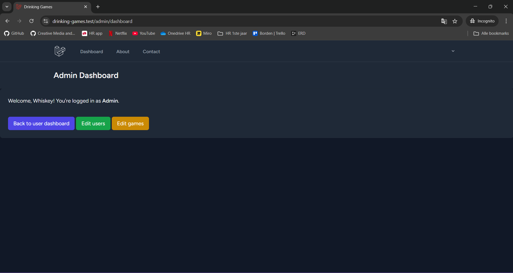
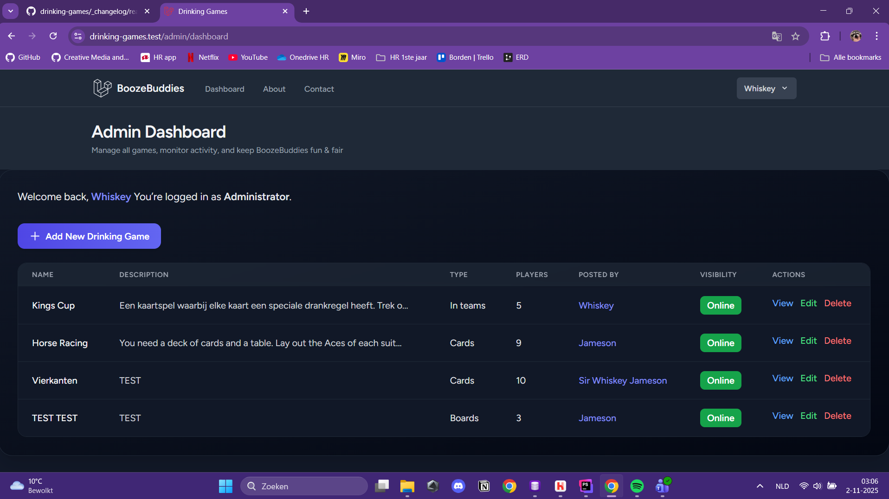

## toggles
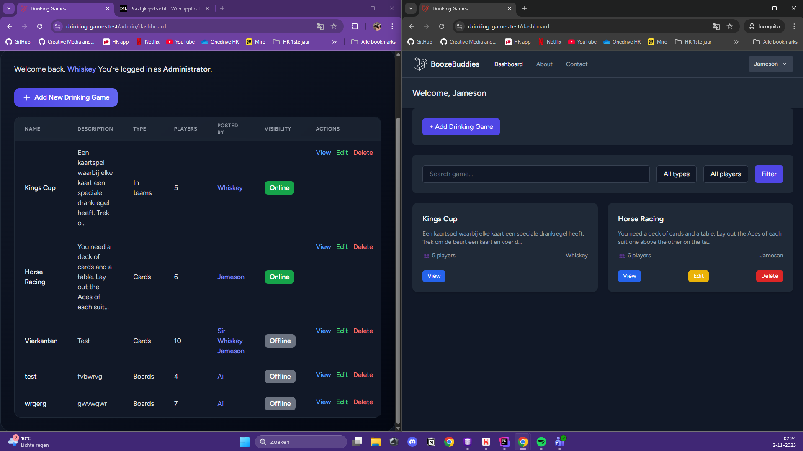
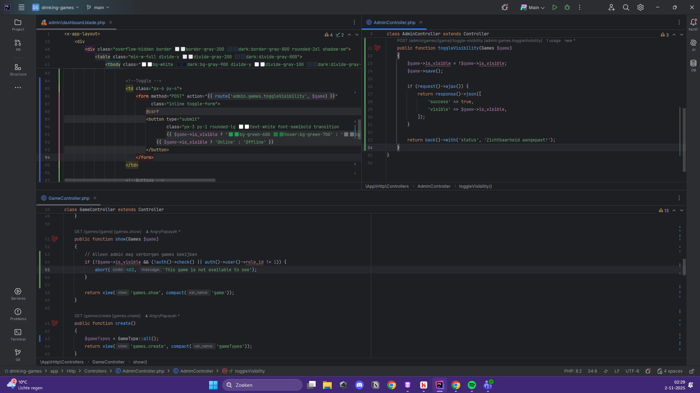

## edit pagina
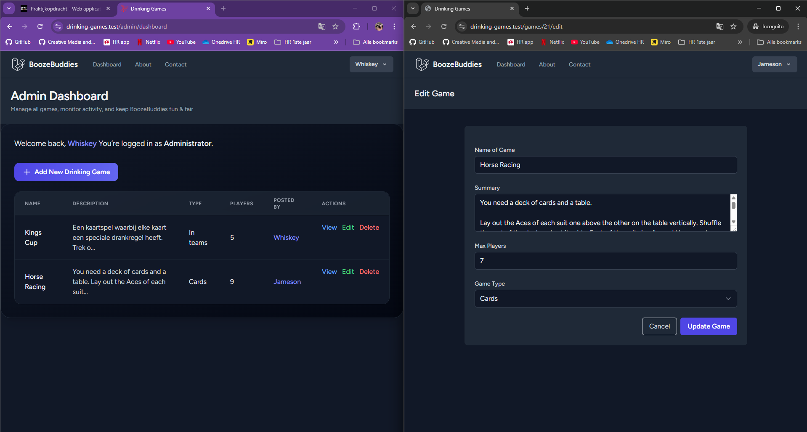
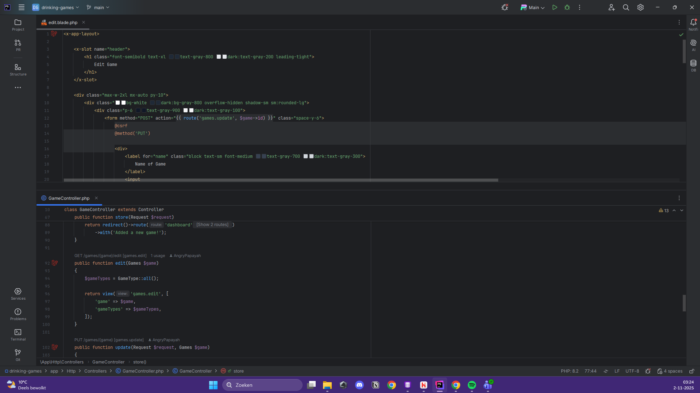

